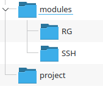

# 3 Module

## Terraform Modules 

Modules are analogous to subroutines
- The root module is like the mainline
- The root module can call other modules
- And other modules can also call other modules

Code analogy
- The root module is like the entry point of a program (like `main()`in C)
- The modules are like the subroutines or functions that are callable

### Why Modules

Usually, our code is organized into deployments 
- Production, Development, Test, etc
- Environments are similar in that they are made up of the same resources
- In fact, different environments will normally have components that are the same across environments
  - Like the part of the Terraform code that creates a resource group in Azure
  - These represent reuse of a basic operation
    
Modules allow us to re-use Terraform code across environments
- DRY Principle: "Do not repeat yourself"
- We want to write re-usable code in only one place.
- Modules allow us to reuse Terraform code just like subroutines allow us to reuse programming code 

This is IaC in action
- The same principles for good programming code design
- There are also the same principles of good IaC programming design
  - Modularity, low coupling, high cohesion, etc

## Module Basics

Any folder containing terraform files is a module
- There is no special declaration or syntax required for it to be identified as a module.
- Conceptually, modules are containers for multiple resources that are used together
- Modules are the primary mechanism used to package and reuse terraform resources

Every terraform configuration has at least one module
- It is referred to as the "root" module
- It consists of the terraform files in the main working directory
- More specifically, the directory where we execute Terraform commands

Any module, not just the root, may import other or "call" other modules
- Modules that are being called are called _child_ modules

---

## Example

If we are creating the same resource in multiple configurations, we can create a reusable module for it

In the lab, the configuration uses a module in the _modules/RG_ folder to create a resource group instance

The folder structure looks like this



The `project` folder is where the Terraform commands are going to be executed
- It is the root module for the Terraform application

Note that we are not making the module a subdirectory of the project directory. 
- This creates a spurious coupling between the project and the RG module.

A better practice is to think of the modules as residing in a module library.
- Later, we will see that this allows for more effective management of large projects and multiple modules.

The code for the RC module looks familiar


```terraform
resource "azurerm_resource_group" "resgrp" {
  name     = "ModuleZippy88e49"
  location = "eastus"
  tags = {
      Sourcing = "Module Generated"
    }
}
```

The root module in the `project` folder has a `providers.tf` file. 
- This is where our Terraform commands are run
- This is why we designate the `project` folder as the root folder.

The actual code in the `root.tf` file in the `project` root module is just a reference or call to the `RG` module.

The `module` directive creates a reference to the `RG` module where the module code is by referencing where the module can be found
- In this case, it is a local file system module that means we can specify it by a pathname

```terraform
module "RG1" {
    source = "../modules/RG"
}
```

If we run `terraform init` from the root module, the command also initializes the specified modules.


## Creating Multiple Resources

We can create multiple copies of a resource by making repeated calls to the module like so:

```terraform
module "RG1" {
    source = "../modules/RG"
}
module "RG2" {
    source = "../modules/RG"
}
```
Or at least we would like to be able to do this
- In this case, Terraform will try and create two resources groups with the same name and Azure will throw an error

## Parametrized Modules

Recall that we can think of invoking a module as being like a function call.
- This is where we can use Terraform variables to parameterize the Module
- Instead of hard coding the name, we can specify a variable in the parameter variables in a `variables.tf` file
- Inside the `RG` module, we need a `variables.tf` file that looks like this

```terraform
variable "RGName" {
    desription = "Name for generated Resource Group"
    type = string
}
```

- Then the module file will look like this
- Exactly the same syntax as using variables in the root module like we saw in the intro course.

```terraform
resource "azurerm_resource_group" "resgrp" {
  name     = var.RGName
  location = "eastus"
  tags = {
      Sourcing = "Module Generated"
    }
}
```

- We can now pass the values for the names as parameters when the module is called
- This looks like this

```terraform
module "RG1" {
    source = "../modules/RG"
    RGName = "Zippy_1"
}

module "RG2" {
    source = "../modules/RG"
    RGName = "Zippy_2"
}
```

## Passing Variable

- The problem is that we still have hard-coded values
- We solve this by creating a `variablea.tf` file in the main project directory that looks like this

```terraform
variable SGnames {
    description = "List of names for the resource groups"
    type = list(string)
 }
```

- In this case, we are passing a list of strings representing names to the root module
- We will look at data types in the next module
-  The corresponding `terraform.tfvars` file looks like this:

```terraform
SGnames = ["Zippy_1", "Zippy_2"]
```

- Then we can parameterize the root module like this:

```terraform
module "RG1" {
    source = "../modules/RG"
    RGName = var.SGnames[0]
}

module "RG2" {
    source = "../modules/RG"
    RGName = var.SGnames[1]
}
```

- Note that each module must have a unique name.
- The value from the root module variable is then passed the RC module variable when the module is called.

## Outputs

- The output or return value from the module is defined in the file `outputs.tf` in the actual module. 
- The `outputs.tf` below is located in the `RG` module and returns the id of the created resource groups


```terraform
output "rg_id" {
  value = azurerm_resource_group.resgrp.id
  description = "The ID of the created resource group resource group"
}
```

### Calling code

- This return value can then be used by the calling module to either
  - Pass it as a parameter to another module
  - Output the value
- In the last case, since we are calling the root module from the command line, we can return the module return values to the command line via an output construct in the root module.


- For example, the value returned in the previous code can now be referenced as `module.<module-name>.<out-var>`
  - The root module could, for example, print out what the module returned with this `outputs.tf` file in the `project` directory

```terraform
output "RG1_id" {
  value       = module.RG1.rg_id
  description = "ID of Resource Group RG1"
}

output "RG2_id" {
  value       = module.RG2.rg_id
  description = "ID of Resource Group RG2"
}

```

## Module Best Practices

- Terraform provides a comprehensive set of documentation on modules.
- We will do a quick overview

[Terraform Modules](https://developer.hashicorp.com/terraform/tutorials/modules/module)


## Security considerations

- Module code should be versioned in its own repository for development
- Access to this repository should be restricted to team that owns the module
- A distribution repository should be public facing and locked down as read-only.
- It should contain only the official version releases
- Before promotion to a distribution repo, it should be thoroughly tested 
- The same DevSecOps security protocols that exist for code should also be applied to Terraform code

## Module Testing

- Modules should be fully unit tested
- They should also be subject to regular code review
- They should be scanned by static code tools like SonarQube
- This usually requires a test harness or mainline that acts as a driver.
- Ensure there is full test case coverage
  - Include invalid and unexpected inputs

## Remote Modules

- Modules can be remote, like in a GitHub repository
- For example, the following accesses the official AKS Azure module

```terraform
module "aks" {
  source  = "Azure/aks/azurerm"
  version = "10.0.2"
  # insert the 2 required variables here
}
```


## End Module
 
