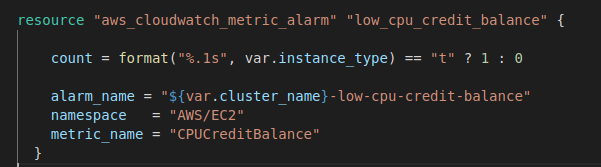

# 4 HCL Programming


## Primitive Data Types

Variables and locals are typed data
There are three primitive data types
- _string_: A Unicode string
- _numeric_: Used for both integral and non-integral values (434 and 1.34)
- _boolean_: `true` and `false`
- _null_: a value that represents absence or omission. If an argument of a resource is `null`, evaluation of the argument behaves as though had been completely omitted it.
    - A variable will use the argument's default value if it has one, or raise an error if the argument is mandatory.

For example, we could have the following locals definitions using different data types

```terraform
locals {
    name = "App Server"
    port = 8080
    private = true
    }
```

---

## Why Data Types

Type Safety
- _Error Checking:_ Allows type checking during plan and apply phases to catch errors early if an incorrect data type is passed to a parameter expecting a specific type
- _Predictable Behavior:_ Ensures that operations on these types behave as expected such as mathematical operations are meaningful with numeric types

Clarity and Intent
- _Clear Intent:_ Using the appropriate data type makes the intention of the code clearer to anyone reading it
- _Simplified Syntax:_ Numeric and boolean types allow for a more straightforward and concise syntax.

Efficiency
- _Optimized Performance:_ Operations on numeric and boolean types are generally more efficient than their string equivalents.
- _Resource Planning:_ Terraform directives that are conditional or need some form of counting work best with boolean and numeric types
- _Validation:_ Stricter validation rules can be enforced on input variables and configuration parameters when types are explicitly defined
- _Terraform Functions:_ Terraform includes built-in functions that operate specifically on certain types

---

## Heredoc Strings

Terraform haa "heredoc" string literal type which allows multi-line strings to be expressed clearly

A heredoc string consists of:
- An opening sequence consisting of:
    - A heredoc marker (<< or <<- — two less-than signs, with an optional hyphen for indented heredocs)
    - A delimiter word of your own choosing
    - A line break
- The contents of the string, which can span any number of lines
- The delimiter word you chose, alone on its own line (with indentation allowed for indented heredocs)

Example

```terraform
message = <--MSRT
this is the body of the message
and more stuff
MSRT
```

These are often useful for multiline directives like start-up scripts.

---

## Complex Data Types

These are similar to the equivalent types in most programming languages

_list (or tuple):_ a sequence of values, like ["alpha", "bext"] indexed starting a 0/

_set:_ a collection of unique values with no specific ordering.

_map (or object):_ a group of values identified by named labels, like {name = "Server", port = 80}


---

## Directives

Declarative languages, like Terraform, normally do not have typical programming constructs like loops and conditional statements

However, there are many scenarios that require the conditional configuration of resources
- For example, creating a module that creates resources only for certain users and not others
- Or creating different sizes of VMs depending on the environment we are deploying into - a small one for `dev`, two medium-sized ones for `test` and four large ones for `prod`

Terraform directives allow certain kinds of operations to perform dynamic and conditional configuration
- While these constructs behave in analogous ways to the constructs in programming languages, they do look syntactically different

--- 

## Loops

Terraform has several loop constructs to provide looping functionality in different scenarios

- _count_ parameter: to loop over resources
- _for_each_ expressions: to loop over resources and inline blocks within a functionality
- _for_ expressions: to loop over lists and maps
- _for_ string directive: to loop over lists and maps withing a string

---

##  Loops with "count"

The looping procedural code is implied and generated under the hood by terraform

We specify the number of iterations with the count, which often represents the number of copies of a resource

The following code creates three instances with the names _VM-0_ , _VM-1_ and _VM-2_

It also goes through a list of owners and assigns each owner to a machine. First in the `variables.tf` file, the list of owners is defined.

```terraform
variable "server_owners" {
   description = "List of server owners"
   type = list(string)
}
```
Notice that the data type is a list of strings and is assigned a value in the `terraform.tfvars` file

```terraform
ami_type = "ami-080e1f13689e07408"
inst_type = "t2.nano"
server_owners = ["accounting","marketing","R&D"]
```

In the `main.tf` file, the VM definition has the `count` directive set to 3. This means that there will be three copies of the VM created. For each iteration the value `count.index` contains the numeric current value of `count`

```terraform
resource "aws_instance" "the_servers" {
  count = 3
  instance_type = var.inst_type
  ami           = var.ami_type
  tags = {
    owner = var.server_owners[count.index]
    Name = "VM-${count.index}"
  }
}
```

Running this code with `terraform apply` produces three servers.

```console
aws_instance.the_servers[1]: Creating...
aws_instance.the_servers[0]: Creating...
aws_instance.the_servers[2]: Creating...
```

---

## Referring to Instances

Because we defined three copies of the server with the Terraform name `the_servers`, we actually created a list of servers called `[the_servers[0], the_servers[1], the_servers[2]]`

To see this, we can output tags of the second server.

```terraform
output "marketin_server_tag" {
    value = aws_instance.the_servers[1].tags
} 
```

And when we run `terraform apply` and ask for the tags, we get back a map of the tags.

```console
Outputs:

marketin_server_tag = tomap({
  "Name" = "VM-1"
  "owner" = "marketing"
})
```

Conceptually, you can think of the `the_servers` directive being inside a for loop with a loop index `count` that starts at 0 and does three iterations.

---


As the previous module showed, even with modules, there can be a lot of repetitive code.
- This code is also brittle and hard to change because it is still hard-coded to a degree


---

## Limitations of Count


Changing the values in a list modifies the created infrastructure  
- For example, deleting any entry (RS[i]) in a list will not cause Terraform to recreate all the resources from the ith position on.
- This is because the deployed resources no longer match what is in the list, so they are deleted and then recreated to match the list
- Terraform cannot just "move everything up one position"


## Loops with "for_each" Expressions

The for_each expression allows looping over lists, sets, and maps to create multiple copies of an entire resource. 

The previous example using `count` is now

```terrform
resource "aws_instance" "Matrix" {
for_each = toset(var.VM_names)
ami = "ami-0c101f26f147fa7fd"
instance_type = "t2.micro"
tags = {
  Name = "VM-${each.value}"
  }
}

variable "VM_names" {
type = list(string)
default = ["Neo",  "Morpheus", "Trinity"]
}
```

The function `toset()` converts the `var.user_names` list into a set
- `for_each` supports sets and maps only when used on a resource

When `for_each` loops each name in the list is made available in the `each` value
- The user name will also be available in `each.key`, but this is usually used only with maps of key/value pair.

Once `for_each` is used on a resource, it creates a map of resources rather than array of resources
- This is why we can't use a list with possible duplicates - it would lead to duplicate keys


## Map Advantages

Maps do not rely on position like lists do
- Allows us to remove items from the middle of a collection safely

Going back to the problem of deleting the middle machine with a map of resources, we get the correct machine deleted because Terraform does not have to count through a list.

--- 


## Looping with Expressions

Terraform allows operations on the data similar to operations in a programming language

Syntax is:

```terraform
  [for < ITEM > in < LIST > : < OUTPUT >]
 ```
Demonstrated in this code:

```terraform
 variable "names" {
    description = "A list of names"
    type        = list(string)
    default     = ["neo", "trinity", "morpheus"]
  }

  output "upper_names" {
     value = [for name in var.names : upper(name)]
  } 

  output "short_upper_names" {
    value = [for name in var.names : upper(name) if length(name) < 5]
  } 


```

## Working with Map Inputs

The for expression can loop over a map as well
  ```
  [for < KEY >, < VALUE > in < MAP > : < OUTPUT >]
  ```

Example of use:

```terraform
variable "hero_thousand_faces" {
description = "map"
type        = map(string)
default     = {
      neo      = "hero"
      trinity  = "love interest"
      morpheus = "mentor"
      }               
}

output "bios" {
value = [for name, role in var.hero_thousand_faces : "${name} is the ${role}"]
}

output "upper_roles" {
value = {for name, role in var.hero_thousand_faces : upper(name) => upper(role)}
}
```

### Outputting a Map

Looping over a list or map can output a map using the syntax:

```terraform
// Loop over a map and output a map
{for < KEY >, < VALUE > in < MAP > : < OUTPUT_KEY > => < OUTPUT_VALUE >}
```

Revisiting the example

```terraform

variable "hero_thousand_faces" {
  description = "map"
  type        = map(string)
  default     = {
    neo      = "hero"
    trinity  = "love interest"
    morpheus = "mentor"
    }
}

output "bios" {
  value = [for name, role in var.hero_thousand_faces : "${name} is the ${role}"]
}

 output "upper_roles" {
    value = {for name, role in var.hero_thousand_faces : upper(name) => upper(role)}
  }

```  


## Conditionals

There are also several different ways to do conditionals, each intended to be used in a slightly different scenario:
- count parameter*: Used for conditional resources

- for_each and for expressions: Used for conditional resources and inline blocks within a resource

- if string directive: Used for conditionals within a string


## Conditionals with "count"


We can define a Boolean variable as our test condition "enable_autoscaling"

We can set the count on a resource to "0" which means that resource is not created

Terraform allows ternary conditionals of the form:

```Terraform
  < CONDITION > ? < TRUE_VAL > : < FALSE_VAL >
```

This allows for conditional creation of resources:

```terraform
variable "make_VM" {
  type = bool
}

resource "aws_instance" "VM" {
    count = var.make_VM ? 1 : 0
    ami = "ami-077e31c4939f6a2f3"
    instance_type = "t2.micro"
    tags = {
        Name = "Conditional"
    }
}
```

## Working with Non-boolean

The previous example worked because we could define a boolean variable
- However, we may have to decode information in a string to make a decision

Example: We want to set a cloud-watch alarm that triggers when CPU credits are low
- However, CPUcredits only "txxx" instances
- Larger instance like m4.large do not return a CPU credit metric and will always appear to be in an INSUFFICIENT_DATA state
- We want the metric to apply to only txxx instance but we don't want to create a special Boolean
- The solution is to utilize the fact that first letter of the instance type should be a "t"



The format function to extract just the first character from var.instance_type.
- If that character is a "t" (e.g., t2.micro), it sets the count to 1;
- otherwise, it sets the count to 0
- This way, the alarm is created only for instance types that actually have a CPUCreditBalance metric.

## END
