# 6: Modules II

## Production Grade Modules

Properties of production grade Terraform modules:
- Small modules 
- Composable modules
- Testable modules
- Releasable modules
- Beyond Terraform modules

---

## Small Modules

A well-known anti-pattern "the Kitchen Sink Module"
- All code gets dumped into a single module
- It just sort of "grows"
- Often the root module

Large modules ( > several hundred lines of code) have downsides - they are:
- **Slow** - the plan phase takes a long time to execute
- **Insecure** - fine-grained permissions on resources becomes almost impossible
- **Risky** - a single error can propagate across the infrastructure
- **Difficult to understand** - they are a wall of (usually disorganized) text
- **Difficult to review** - not just to read, but the plan output is overwhelming to read
- **Difficult to test** - testing is hard enough already

---

## General Design Principles

In engineering, there are three basic design principles:

**Modularity**: systems are organized in self-contained packages or modules

**Cohesion**: each module should provide one service and only one module provides each service

**Coupling**: The connections between modules are only through defined interfaces

These ideas should be implemented in Terraform production modules.

---

## Releasable Modules

Modules should be made available for use only after they have been "released"

Another option for releasing modules is to publish them in the Terraform Registry
- The Public Terraform Registry resides at https://registry.terraform.io/
- It includes hundreds of reusable, community-maintained, open source modules for AWS, Google Cloud, Azure, and many other providers

## Publishing Requirements

There are a few requirements to publish a module to the Public Terraform Registry
- The module must live in a public GitHub repo
- The repo must be named terraform-< PROVIDER >-< NAME >, where PROVIDER is the provider the module is targeting (e.g., aws) and NAME is the name of the module
- The module must follow a specific file structure, including defining Terraform code in the root of the repo, providing a README.md, and using the convention of main.tf, variables.tf, and outputs.tf as filenames
- The repo must use Git tags with semantic versioning (x.y.z) for releases

## Using the Registry

Terraform even supports a special syntax for consuming modules from the Terraform Registry
- You can use a special shorter registry URL in the source argument and specify the version via a separate version argument using the following syntax:

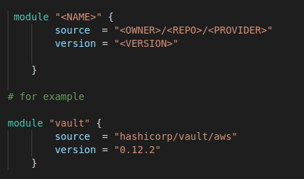

## Beyond Modules

Sometimes non Terraform code has to be run from a Terraform module or integrate with other tools or systems

Sometimes we have to work around a limitation of Terraform, like trying implement complicated logic

Some Terraform "escape hatches" are:
- Provisioners
- Provisioners with _null_resource_
- External Data Source

### Provisioners

Provisioners are used to execute scripts either on the local machine or a remote machine, typically to do the work of bootstrapping, configuration management, or cleanup

There are several types of provisioners
- _local-exec_: execute a script on the local machine
- _remote-exec_: execute a script on a remote resource
- _chef_: run Chef client on a remote resource
- _file_: copy files to a remote resource

### Provisioner Block

Provisioners are added using the a `provisioner block`

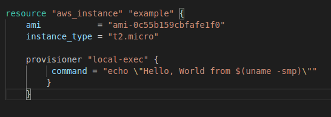

Running `terraform apply` produces:

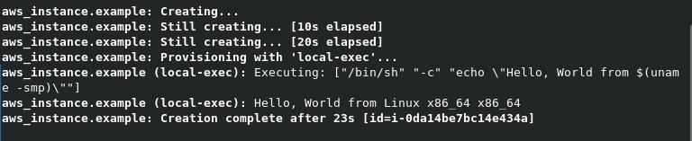

### Remote Provisioning

Assume we want to provision an EC2 instance, we have to connect to the instance and authenticate to it
- In this example we will use SSH
- We need a security group to allow SSH access:

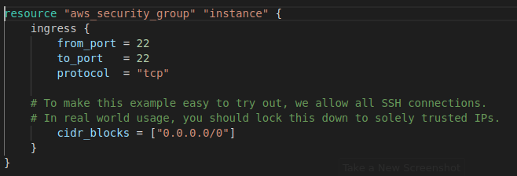

#### Generate SSH Keys

This stores the key in the state which we would not want to do in a production environment and upload to aws using the `aws_key_pair` resource

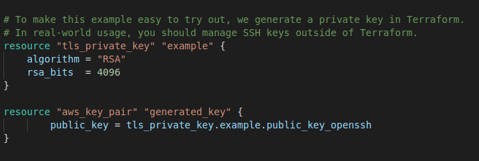

#### Creating and Connecting to the Instance

The inline argument to pass a list of commands to execute, instead of a single command argument
- But we also have to configure the EC2 instance to use ssh
- The `self` keyword is a work-around for provisioners to avoid circular dependencies.

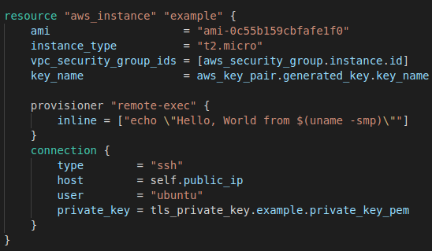

#### Output

Running _terraform apply_ produces:

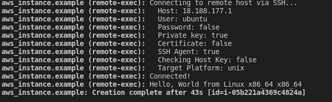

### Data Scripts versus Provisioners

Advantages to using a provisioner
- Data scripts are limited to a length of 16KB, while provisioner scripts can be arbitrarily long
- Chef and other provisioners install, configure, and run on clients, which makes it easier to use configuration management tools

The advantages to User Data scripts are:
- You can use User Data scripts with ASGs, but Provisioners take effect only while Terraform is running and don't work with ASGs at all
- The User Data script can be seen in the EC2 Console and you can find its execution log on the EC2 Instance itself, both of which are useful for debugging,neither of which is available with provisioners

### Provisioners with "null_resource"

- Sometimes, you want to execute a provisioner without tying it to a specific resource
- we can use a _null_resource_ which acts just like a normal terraform resource, except that it does not create anything 
- The _null_resource_ has an argument called triggers, which takes in a map of keys and values
- Whenever the values change, the null_resource will be recreated
- This forces any provisioners within it to be re-executed
- For example, the uuid() built-in function, which returns a new, randomly generated UUID each time it's called, within the triggers argument

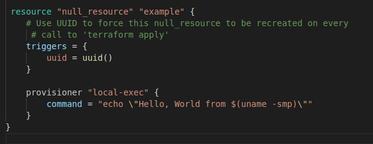

#### Output from _null_resource_
- Every time you call terraform apply, the local-exec provisioner will execute:
- The output from the previous example is:

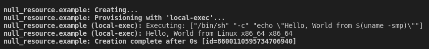 
    

### External Data Source

For situations where  we want to execute a script to fetch some data and make that data available within the Terraform code itself
- External data source allows an external command that implements a specific protocol to act as a data source

The protocol is:Data passes terraform to the external program using the query argument of the external data source 
- The external program can read in these arguments as JSON from stdin
- The external program can pass data back to Terraform by writing JSON to stdout
- Terraform code can then pull data out of this JSON by using the result output attribute of the external data source

This example uses the external data source to execute a Bash script that echoes back to stdout any data it receives on stdin

  
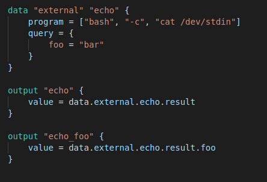

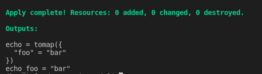

##  Types of Testing for Terraform in Azure

1. _Linting / Static Analysis:_ Check Terraform code syntax and style before applying
2. _Unit Testing:_ Validate modules, variables, and output logic without deploying
3. _Integration Testing:_ Deploy infrastructure in a sandbox and assert expected outcomes
4. _Policy Compliance:_ Ensure resources conform to security and governance policies
5. _Drift Detection:_ Detect unexpected changes in live Azure infrastructure

### Tools

Comments taken from the tool websites

Linting
- [tflint](https://github.com/terraform-linters/tflint)
- TFLint is a framework, and each feature is provided by plugins, the key features are as follows:
  - Find possible errors (like invalid instance types) for Major Cloud providers (AWS/Azure/GCP).
  - Warn about deprecated syntax, unused declarations.
  - Enforce best practices, naming conventions.

Policy Checking
- [checkov](https://github.com/bridgecrewio/checkov)
- Checkov is a static code analysis tool for infrastructure as code (IaC) and also a software composition analysis (SCA) tool for images and open source packages.
  - It scans cloud infrastructure provisioned using Terraform, Terraform plan, Cloudformation, AWS SAM, Kubernetes, Helm charts, Kustomize, Dockerfile, Serverless, Bicep, OpenAPI, ARM Templates, or OpenTofu and detects security and compliance misconfigurations using graph-based scanning.
  - It performs Software Composition Analysis (SCA) scanning which is a scan of open source packages and images for Common Vulnerabilities and Exposures (CVEs).

Testing
- [terratest](https://terratest.gruntwork.io/)
- Golang tool for testing terraform configurations

### Terraform + SonarQube Integration

Native Terraform Support
- SonarQube does not natively support .tf files.
- You must:
  - Use external linters (e.g., TFLint, Checkov) as part of a CI/CD pipeline
  - Export their results in SARIF or other supported formats
  - Import results into SonarQube using plugins or CLI

Recommended Flow:
- Run TFLint/Checkov
  - Output results to JSON or SARIF format.
- Use SonarScanner CLI
  - Feed results via custom plugin or quality gate.
- Use SonarQube Generic Issue Data Format
  - Inject external tool results into SonarQube.

## Security

### Secure State Management

Use a Remote Backend
- Store Terraform state remotely (e.g., Azure Blob Storage, AWS S3, GCS).
- Prevents local file loss and reduces insider threat risks.
- Enables locking and collaboration.

Enable Encryption
- At rest: Ensure backend storage (e.g., Azure Blob with CMK, S3 SSE-KMS) encrypts the state file.
- In transit: Use HTTPS/TLS for all state transfers.

State Locking
- Use backends that support concurrent lock control:
  - S3 + DynamoDB
  - Azure Blob (via lease mechanism)
- Prevents overlapping plan/apply runs.

Avoid Storing Secrets in State
- State may expose secrets in plaintext.
- Use sensitive = true on outputs (but this doesn’t stop storage in state).
- Never store credentials directly in variables.

### Secure Secrets Management

Use Cloud-Native Secret ManagersStore and retrieve sensitive values from 
- Azure Key Vault
- AWS Secrets Manager
- GCP Secret Manager

Best Practice

- Use terraform-provider-vault, azurerm_key_vault_secret, or external data source to dynamically pull secrets during plan/apply time.

### Least Privilege Access Control

Role-Based Access Control (RBAC)
- Use Terraform Cloud/Enterprise RBAC or cloud IAM roles to restrict state and apply access.
- IAM Roles (AWS) / Managed Identities (Azure)
  - Prefer roles and identities over long-lived credentials.
  - Use short-lived tokens with federated login where possible.

Minimize User Access
- Only grant terraform apply to trusted agents (e.g., CI pipelines).
- Use owner/maintainer/reviewer roles explicitly.

## Security Scanning & Auditing

IaC Scanning Tools. Use:
- Checkov or TFLint for static checks
- SonarQube and Aqua Trivy to detect:
  - Misconfigured NSGs
  - Unencrypted storage
  - Open ports, etc.

Code Reviews
- Mandate PR reviews in GitOps workflows.
- Use tools like GitHub Actions, Azure DevOps policies, or GitLab approvals.

Audit Logging
- Enable audit logs for:
  - Terraform Cloud/Enterprise
  - Backend storage (e.g., Azure Storage analytics logs, AWS CloudTrail for S3)
  - CI/CD pipelines (who ran apply, when, what changed)

## Infrastructure as Code (IaC) Practices

Modularization
- Organize reusable components into modules.
- Promotes reuse, testing, and secure defaults.

Automated Deployment Pipelines
- CI/CD tools: Azure DevOps, GitHub Actions, GitLab CI
- Ensure pipelines run terraform fmt, validate, tflint, checkov, and enforce manual approvals on apply.

Version Control
- Use Git for all Terraform code.
- Enable branch protection, change traceability, and rollbacks.

Naming Conventions
- Enforce patterns like: env-app-resource-type
  - Example: dev-myapi-vnet

Tagging
- Use standard tags like owner, env, cost-center, project, compliance.
- Helps enforce policy via Azure Policy or GCP Org Policy.

## Other Important Practices

Regular Updates
- Keep Terraform CLI and providers updated:
  - terraform init -upgrade
- Pin versions in required_providers and terraform blocks.

Secure Communication
- Always use https:// for remote backends.
- Block public state access on storage containers/buckets.

Enforce Multi-Factor Authentication (MFA)
- Require MFA for cloud consoles and Terraform Cloud logins.
- Combine with federated login (e.g., Azure AD + GitHub)

Centralized Security Policies
- Define reusable policy packs using: Azure Policy for resource enforcement

Pre-Apply Checks
- Integrate CI checks before apply:
  - terraform validate
  - terraform plan approval gates
  - Static analysis (Checkov, TFLint)
  - Manual approval for production

## End
