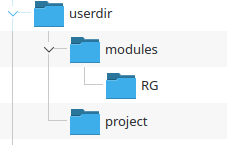

# Lab 3: Modules

In this lab, you will create a run a simple module based Terraform application.

***NOTE!!! This lab uses the names for the RGs as "Zippy_1" and "Zippy_2 You need to change these using the sample code to unique identifiers so your RG names are unique in the class***


## Part 1: Set Up

- Since we will be using a project directory, you can leave the Terraform files created in the main directory by previous labs.

### Create the directory structure

- Create a new directory called `project`
- This will be the root module of our application


- Create another director at the same level called `modules`
- This is going to represent a library of reusable modules that will be called by the root module of our application

- Create two subdirectories in the module directory named:
  - `RG`: This is the module that will create resource groups


- Your application directory structure should look like this



--- 

## Part 2: Add the terraform code

- Initially, we will be only working with the RG module.
- Edit the file `RG.tf` in your lab repo to ensure the resource group has a unique name.
- Notice this is exactly the same code you have seen before

```terraform
resource "azurerm_resource_group" "resgrp" {
  name     = "ModuleZippy88e49"
  location = "eastus"
  tags = {
      Sourcing = "Module Generated"
    }
}
```

- Using the upload utility leaves the file in the main directory
- Copy it to the RG directory 
- Confirm it is there

```console
od [ ~ ]$ cd modules/RG
rod [ ~/modules/RG ]$ cp ~/RG.tf .
rod [ ~/modules/RG ]$ ls
RG.tf

```
 
#### Root module
- Now do the same for `root.tf` file
- Upload and copy it to the `project` directory
- Repeat with the `providers.tf` file you used in the last lab

- The `root.tf` file looks like this
- It consists of a single call to the module, specified by the pathname to the module

```console
module "RG1" {
    source = "../modules/RG"
}
```

- Your project directory should look like this

```console
rod [ ~/project ]$ ls -l
total 16
-rw-r--r-- 1 rod rod  197 Jun  1 18:35 providers.tf
-rw-r--r-- 1 rod rod   45 Jun  1 19:51 root.tf
```

## Part 3: Initialize

- You must run `terraform init` **from the current project directory**
- Notice that Terraform will se that you are using modules and will generate the code needed to combine the modules into an application
- This means that it will be keeping track of the state of resources generated by the called modules

```console

[ ~/project ]$ terraform init
Initializing the backend...
Initializing modules...
- RG1 in ../modules/RG
Initializing provider plugins...
- Finding latest version of hashicorp/azurerm...
- Installing hashicorp/azurerm v4.31.0...
- Installed hashicorp/azurerm v4.31.0 (signed by HashiCorp)
Terraform has created a lock file .terraform.lock.hcl to record the provider
selections it made above. Include this file in your version control repository
so that Terraform can guarantee to make the same selections by default when
you run "terraform init" in the future.

Terraform has been successfully initialized!

You may now begin working with Terraform. Try running "terraform plan" to see
any changes that are required for your infrastructure. All Terraform commands
should now work.

If you ever set or change modules or backend configuration for Terraform,
rerun this command to reinitialize your working directory. If you forget, other
commands will detect it and remind you to do so if necessary.
```

## Part 4: Create and confirm the deployment

- Run `terraform apply` and create the resource group

```console
terraform apply

Terraform used the selected providers to generate the following execution plan. Resource actions are indicated with the following symbols:
  + create

Terraform will perform the following actions:

  # module.RG1.azurerm_resource_group.resgrp will be created
  + resource "azurerm_resource_group" "resgrp" {
      + id       = (known after apply)
      + location = "eastus"
      + name     = "ModuleZippy88e49"
      + tags     = {
          + "Sourcing" = "Module Generated"
        }
    }

Plan: 1 to add, 0 to change, 0 to destroy.

Do you want to perform these actions?
  Terraform will perform the actions described above.
  Only 'yes' will be accepted to approve.
```
  
- Confirm the deployment exists and then tear it down with `terraform destroy`

```console
terraform destroy
module.RG1.azurerm_resource_group.resgrp: Refreshing state... [id=/subscriptions/fxxxxxxxxxxxxxxxxx-a316-576364d2886b/resourceGroups/ModuleZippy88e49]

Terraform used the selected providers to generate the following execution plan. Resource actions are indicated with the following symbols:
  - destroy

Terraform will perform the following actions:

  # module.RG1.azurerm_resource_group.resgrp will be destroyed
  - resource "azurerm_resource_group" "resgrp" {
      - id         = "/subscriptions/f1axxxxxxxxxxxxxx0xxxxxxxxxxxxd2886b/resourceGroups/ModuleZippy88e49" -> null
      - location   = "eastus" -> null
      - name       = "ModuleZippy88e49" -> null
      - tags       = {
          - "Sourcing" = "Module Generated"
        } -> null
        # (1 unchanged attribute hidden)
    }

Plan: 0 to add, 0 to change, 1 to destroy.

```

** Save your work, you will need it in the next lab**

## End Lab