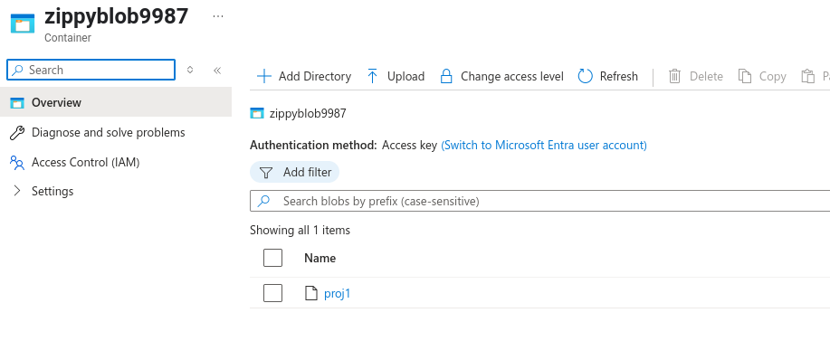

# Lab 7: Remote Backends

In this lab, you will create and use a remote backend

## Part 1: Setup

- Create a new directory called `backend`
- This will be used to create the backend resources
- Upload your standard `providers.tf` file and move it into the `backend` directory

## Part 2: The backend configuration

- The Terraform configuration is in the `backend.tf` file

```terraform
resource "azurerm_resource_group" "tf_backend_rg" {
  name     = "<your unique name>"
  location = "eastus"
}

resource "azurerm_storage_account" "tf_backend_sa" {
  name                     = "<globally unique name>" # must be globally unique
  resource_group_name      = azurerm_resource_group.tf_backend_rg.name
  location                 = azurerm_resource_group.tf_backend_rg.location
  account_tier             = "Standard"
  account_replication_type = "LRS"
}

resource "azurerm_storage_container" "tf_backend_container" {
  name                  = "<blob-name>"
  storage_account_name  = azurerm_storage_account.tf_backend_sa.id
  container_access_type = "private"
}
```
- You need to provide the unique names where indicated
- An example is given below

```terraform 
resource "azurerm_resource_group" "tf_backend_rg" {
  name     = "backend8839387"
  location = "eastus"
}

resource "azurerm_storage_account" "tf_backend_sa" {
  name                     = "zippy998938" # must be globally unique
  resource_group_name      = azurerm_resource_group.tf_backend_rg.name
  location                 = azurerm_resource_group.tf_backend_rg.location
  account_tier             = "Standard"
  account_replication_type = "LRS"
}

resource "azurerm_storage_container" "tf_backend_container" {
  name                  = "zippyblob9987"
  storage_account_id  = azurerm_storage_account.tf_backend_sa.id
  container_access_type = "private"
}
```

- Edit the `backend.tf` file to include your unique names
- Upload it and move it to the `backend` directory
- Go the `backend` directory and confirm the files are there

```console
rod [ ~/backend ]$ ls
backend.tf  providers.tf
```

## Part 3: Create the backend

- In the `backend` directory, run `terraform init`
- Once it is initialized run `terraform apply`
- You should see three resources created

```console
azurerm_resource_group.tf_backend_rg: Creating...
azurerm_resource_group.tf_backend_rg: Still creating... [10s elapsed]
azurerm_resource_group.tf_backend_rg: Creation complete after 10s [id=/subscriptions/f1a145f5-f75d-4170-a316-576364d2886b/resourceGroups/backend8839387]
azurerm_storage_account.tf_backend_sa: Creating...
azurerm_storage_account.tf_backend_sa: Still creating... [10s elapsed]
azurerm_storage_account.tf_backend_sa: Still creating... [20s elapsed]
azurerm_storage_account.tf_backend_sa: Still creating... [30s elapsed]
azurerm_storage_account.tf_backend_sa: Still creating... [40s elapsed]
azurerm_storage_account.tf_backend_sa: Still creating... [50s elapsed]
azurerm_storage_account.tf_backend_sa: Still creating... [1m0s elapsed]
azurerm_storage_account.tf_backend_sa: Creation complete after 1m3s [id=/subscriptions/f1axxxxxxxxxxxxxxxxxxxxxxxxxxxxx886b/resourceGroups/backend8839387/providers/Microsoft.Storage/storageAccounts/zippy998938]
azurerm_storage_container.tf_backend_container: Creating...
azurerm_storage_container.tf_backend_container: Creation complete after 1s [id=/subscriptions/f1axxxxxxxxxxxxxxxxxxxxxxxxxx4d2886b/resourceGroups/backend8839387/providers/Microsoft.Storage/storageAccounts/zippy998938/blobServices/default/containers/zippyblob9987]

Apply complete! Resources: 3 added, 0 changed, 0 destroyed.
```

The backend is now ready for use
- Check the GUI to see the resources that have been created

## Part 4: Setting up to use the backend

- Create a new director under the main directory called `proj1`
- The `providers.tf` for `proj1` needs to specify the remote backend for the state files

```terraform 
terraform {
  required_providers {
    azurerm = {
      source  = "hashicorp/azurerm"
    }
  }
}

terraform {
  backend "azurerm" {
    resource_group_name  = "<the one you created in the last part>"
    storage_account_name = "<the one you created in the last part>"
    container_name       = "<the one you created in the last part>"
    key                  = "proj1"
  }
}

provider "azurerm" {
  features {}
  subscription_id = "your subscription"
}

```

- The key value will be used to distinguish the state files for `proj1` from other state files
- Using the values from the example, the file would look like

```terraform
terraform {
  backend "azurerm" {
    resource_group_name  = "backend8839387"
    storage_account_name = "zippy998938"
    container_name       = "zippyblob9987"
    key                  = "proj1"
  }
}
```

- Edit the `main.tf` file to create a unique resource group

```terraform 
resource "azurerm_resource_group" "RG" {
  name     = "<unique-name"
  location = "eastus"
}
```

- Upload the `providers.tf` and `main.tf` files and move them into the `proj1` directory
- Confirm they are there


- Now run `terraform init` in the `proj` directory to use the backend

```console
od [ ~ ]$ cd proj1
rod [ ~/proj1 ]$ terraform init
Initializing the backend...

Successfully configured the backend "azurerm"! Terraform will automatically
use this backend unless the backend configuration changes.
Initializing provider plugins...
- Finding latest version of hashicorp/azurerm...
- Installing hashicorp/azurerm v4.31.0...
- Installed hashicorp/azurerm v4.31.0 (signed by HashiCorp)
Terraform has created a lock file .terraform.lock.hcl to record the provider
selections it made above. Include this file in your version control repository
so that Terraform can guarantee to make the same selections by default when
you run "terraform init" in the future.

Terraform has been successfully initialized!

You may now begin working with Terraform. Try running "terraform plan" to see
any changes that are required for your infrastructure. All Terraform commands
should now work.

If you ever set or change modules or backend configuration for Terraform,
rerun this command to reinitialize your working directory. If you forget, other
commands will detect it and remind you to do so if necessary.

```

## Part 5: Create the deployment

- Run `terraform apply` from the `proj` directory

```console
terraform apply

Terraform used the selected providers to generate the following execution plan. Resource actions are indicated with the following symbols:
  + create

Terraform will perform the following actions:

  # azurerm_resource_group.RG will be created
  + resource "azurerm_resource_group" "RG" {
      + id       = (known after apply)
      + location = "eastus"
      + name     = "prodRGxxxxx"
    }

Plan: 1 to add, 0 to change, 0 to destroy.

Do you want to perform these actions?
  Terraform will perform the actions described above.
  Only 'yes' will be accepted to approve.

  Enter a value: yes

azurerm_resource_group.RG: Creating...
azurerm_resource_group.RG: Still creating... [10s elapsed]
azurerm_resource_group.RG: Creation complete after 10s [id=/subscriptions/f1axxxxxxxxxxxxxxxxxxxxxxxxx64d2886b/resourceGroups/prodRGxxxxx]

Apply complete! Resources: 1 added, 0 changed, 0 destroyed.
```

## Part 6: Confirm the state file is in the blob

- Using the GUI, examine the contents of the blob



# Part 7: Switch to a local back end

- In the `proj1` directory, edit the `providers.tf` file to remove reference to the remote backend so that it looks like the other `providers.tf` files whe have been using
- Run `terraform init -migrate-state`

```console
rod [ ~/proj1 ]$ terraform init -migrate-state
Initializing the backend...
Terraform has detected you're unconfiguring your previously set "azurerm" backend.
Do you want to copy existing state to the new backend?
  Pre-existing state was found while migrating the previous "azurerm" backend to the
  newly configured "local" backend. No existing state was found in the newly
  configured "local" backend. Do you want to copy this state to the new "local"
  backend? Enter "yes" to copy and "no" to start with an empty state.

  Enter a value: yes


Successfully unset the backend "azurerm". Terraform will now operate locally.
Initializing provider plugins...
- Reusing previous version of hashicorp/azurerm from the dependency lock file
- Using previously-installed hashicorp/azurerm v4.31.0

Terraform has been successfully initialized!

You may now begin working with Terraform. Try running "terraform plan" to see
any changes that are required for your infrastructure. All Terraform commands
should now work.

If you ever set or change modules or backend configuration for Terraform,
rerun this command to reinitialize your working directory. If you forget, other
commands will detect it and remind you to do so if necessary.
```

- Confirm there is now a local state file in `proj1` directory

```console
rod [ ~/proj1 ]$ ls -l
total 12
-rw-r--r-- 1 rod rod  93 Jun  2 11:38 main.tf
-rw-r--r-- 1 rod rod 199 Jun  2 11:54 providers.tf
-rw-r--r-- 1 rod rod 967 Jun  2 11:54 terraform.tfstate
```

## Part 8: Clean up

- In the `proj1` directory, run `terraform destroy`
- In the `backend` directory, run `terraform destroy`

## End Lab